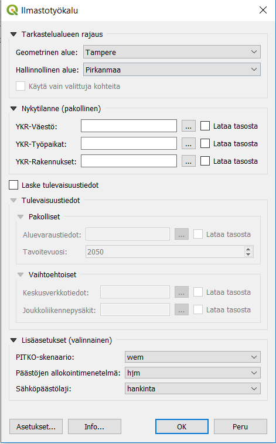

# Climate Tool

Climate Tool is a QGIS plugin for assessing climate impacts in cities. The plugin is under development and will be released here in June 2019. The tool is modelling the climate impacts in the cities. It provides  information about the current CO2 emission situation in the cities by taking into account various emission sources. It also provides scenarios for the future using land use planning information. In the inital phace only datasets from the City of Tampere are used. The plugin will need a PostGIS connection and several ready made datasets in the database in order to work. 

## Team

**Developed by the joint cooperation of [City of Tampere](https://www.tampere.fi/), [Ubigu Ltd](https://www.ubigu.fi/en/), [Tietotakomo](https://www.tietotakomo.fi/) & [Gispo Ltd](https://www.gispo.fi/en/home/).**

The plugin is still in beta-development. Please report issues to mikael@gispo.fi.

Many thanks to the project team!

## Licences

This plugin relies on urban zone data provided by Statistics Finland and Finland's environmental administration **Please read [https://www.stat.fi/tup/ykraineistot/index.html](https://www.stat.fi/tup/ykraineistot/index.html) for more information.**

**Read also [data/lisence.txt](data/lisence.txt) for more information.**

## Installation instructions

### Dependencies

Before installing the plugin, make sure to install the Python [requests-library](http://docs.python-requests.org/). This can be done by executing the command:

```pip install requests```

On Windows QGIS installations, installing the requests library can be done using the OSGeo4W Shell. Open the shell as an administrator and run commands:

```
py3_env
pip install requests
```

Python-requests may be replaced by the QGIS built-in [QgsFileDownloader](https://qgis.org/pyqgis/3.2/core/File/QgsFileDownloader.html) class in a future version of the plugin.

### QGIS Plugin

1. Download the repository as a zip using the Clone or download button in GitHub (above).

2. Launch QGIS and the plugins menu by selecting Plugins - Manage and Install Plugins from the top menu.

3. Select the Install from ZIP tab, browse to the zip file you just downloaded, and click Install Plugin!

## Usage

Using the plugin is fairly straightforward:

1. Coming up

## Documentation

- [Database and database model](docs/database.md)
- [Descriptions for visualizations](docs/visualization.md)
- [Dataset requirements](docs/dataset_requirements.md)
- [Data lisences](data/lisence.md)

- Plugin documentation (coming up)

## Software requirements

- QGIS 3.4.6
- PostgreSQL 9.4 (tested on PostgreSQL 9.6+)
- PostGIS 2.1.8 (tested on 2.2+)

## Description


The tool can be used by city developers (land use planners) for
- Understanding the current situation of CO2 emissions in the community
- Detect the effects of land use planning (planned building, use and maintanence) in CO2 emission levels
- See trends in of CO2 emission changes in the future

Climate Tool takes into account several data sources from the cities:

- Building
- Traffic
- Public transportation
- Electricity consumption
- Heating
- Carbon sinks
- Land use plans
- Scenario information for the future

## Process
- Open QGIS
- Install QGIS Climate Tool plugin
- Check the PostGIS database connection (hosted at the moment by Ubigu Ltd)
- Open QGIS Climate Tool plugin
- Choose the area for your calculations (in this stage only City of Tampere)
- Choose a governmental area (it provides certain parameters to the calculations)
- Add information about the current situation (Population, Jobs, Buildings) in requested format
- Choose if you want to calculate also future scenarios 
- Add land use planning zoning elements
- Set target Year
- Optional: add Keskusverkkotiedot (centers in the city by network information)
- Optional: add intensive public transportation stations (train, metro, tram)
- Advanced: add PITKO scenario (heating and electricity scenarios) or use default parameters
- Advanced: add emission allocation methods
- Advanced: add used electricity emission sources

## End results:

- 250*250 m grid, vector layers in PostGIS database
- CO2 emissions of different emission sources in the cities. Current situation as map layer.
- Predictions of CO2 emissions in the future (using scenarios from land use planning). Target year as map layer, yearly scenarios as tables
- Ready made visualizations for the map layers including grids and top emission source/grid cell


